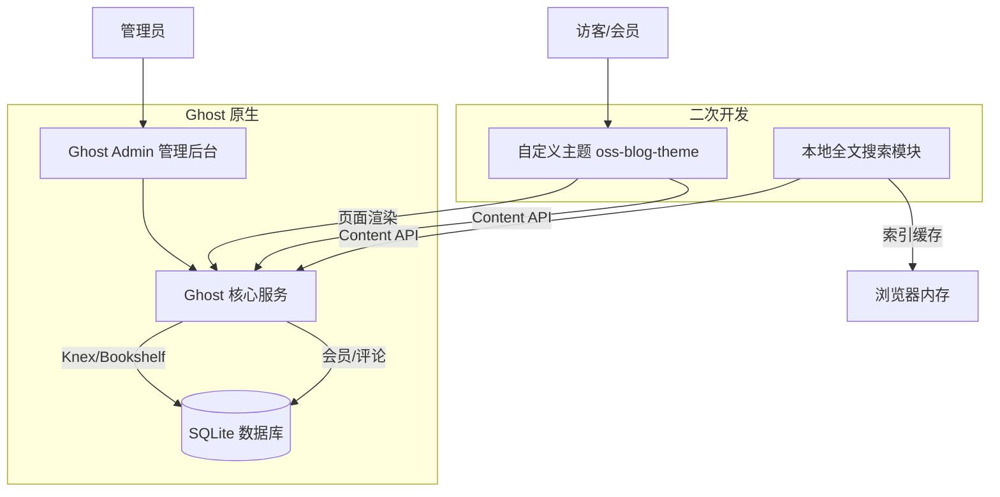

# 开源个人博客系统

基于 Ghost 开源博客平台二次开发的个人博客系统，支持文章发布、标签分类、会员评论和本地全文搜索。

## 项目简介

本项目是《开源软件与新技术》课程实验01的成果。以成熟开源项目 [Ghost](https://github.com/TryGhost/Ghost) v6.59.0 为运行基线，基于官方 [Source](https://github.com/TryGhost/Source) 主题 v1.7.2 进行二次开发，实现了可辨识的自定义主题和本地全文索引搜索功能。

**一句话简介**：一个支持注册、写作、评论、搜索的个人博客系统，具备本地全文索引搜索和关键词高亮功能。

## 目标用户与功能清单

### 目标用户
- 个人博客作者
- 开源软件学习者
- 需要内容管理平台的开发者

### 功能清单

| 功能 | 说明 | 来源 |
|------|------|------|
| 会员注册/登录 | 支持会员注册、登录和账号管理 | Ghost 原生 |
| 文章发布与编辑 | 富文本编辑器，支持草稿和发布 | Ghost 原生 |
| 标签分类 | 文章可关联多个标签，按标签浏览 | Ghost 原生 |
| 评论系统 | 会员可对文章发表评论 | Ghost 原生 |
| 本地全文搜索 | 客户端全文索引，支持关键词高亮和无结果建议 | **二次开发** |
| 自定义主题 | 修改导航、文章卡片和详情页样式 | **二次开发** |
| 阅读时长显示 | 文章卡片和详情页显示预计阅读时长 | **二次开发** |
| 数据备份恢复 | 支持内容导出和恢复 | Ghost 原生 |

## 技术栈与系统架构

### 技术栈

| 层级 | 技术 | 版本 |
|------|------|------|
| 运行时 | Node.js | v22.23.2 LTS |
| 博客平台 | Ghost | 6.59.0 |
| 数据库 | SQLite3 | 随 Ghost 安装 |
| 管理后台 | Ember.js | 随 Ghost 安装 |
| 主题模板 | Handlebars | 随 Ghost 安装 |
| 主题构建 | Gulp + PostCSS | 主题内置 |
| 前端搜索 | 原生 JavaScript | 无第三方依赖 |
| 包管理 | pnpm / npm | pnpm 12.3.4 |
| 版本管理 | Git | 2.54.0 |

### 系统架构



## 环境要求

### 必需软件

| 软件 | 最低版本 | 检查命令 |
|------|----------|----------|
| Node.js | 22 LTS | `node --version` |
| npm | 10+ | `npm --version` |
| pnpm | 11.10+ | `pnpm --version` |
| Git | 2.40+ | `git --version` |
| Ghost CLI | 1.32+ | `ghost --version` |

### 安装 Ghost CLI

```bash
npm install -g ghost-cli@latest
pnpm install -g pnpm@latest
```

## 安装与运行

### 1. 克隆项目

```bash
git clone <仓库地址>
cd oss-blog
```

### 2. 安装 Ghost 运行时

```bash
cd runtime
ghost install local --version 6.59.0
```

> 注意：如果 `ghost install local` 因版本检测失败，可使用 `--zip` 参数从本地压缩包安装。

### 3. 配置

复制配置文件（如不存在）：

```bash
# config.development.json 已包含在项目中
# 默认配置：端口 2368，SQLite 数据库
```

### 4. 启动

```bash
cd runtime
ghost start
```

启动后访问：
- 前台：http://localhost:2368/
- 管理后台：http://localhost:2368/ghost/

### 5. 停止

```bash
cd runtime
ghost stop
```

### 6. 查看状态

```bash
cd runtime
ghost ls
ghost log
```

## 主题安装与回滚

### 安装自定义主题

1. 打包主题：
   ```bash
   cd theme/oss-blog-theme
   # 方式一：使用 gulp
   npm install
   npm run zip
   
   # 方式二：直接压缩
   Compress-Archive -Path * -DestinationPath ../oss-blog-theme.zip
   ```

2. 上传主题：
   - 进入管理后台 → Settings → Design & branding → Change theme
   - 点击 Upload theme，上传 `oss-blog-theme.zip`
   - 点击 Activate 激活

### 主题回滚

- 进入管理后台 → Settings → Design & branding → Change theme → Installed
- 选择 source 或 casper 主题，点击 Activate

## 演示数据

### 演示账号

| 角色 | 邮箱 | 密码 |
|------|------|------|
| 管理员 | admin@demo.com | Demo123456 |
| 会员1 | user1@demo.com | （通过邮件链接登录） |
| 会员2 | user2@demo.com | （通过邮件链接登录） |

> 安全提示：以上为演示账号，实际部署时请修改密码。会员账号通过 Ghost Portal 邮件链接登录，无需密码。

### 演示内容

- **8篇文章**：覆盖技术、生活、随笔等主题
- **4个标签**：News、技术、生活、随笔
- **2个会员账号**：用于测试评论和权限

### 重新生成演示数据

```bash
# 安装依赖
pip install PyJWT requests

# 运行脚本（需先在 Ghost 管理后台创建 Custom Integration 获取 Admin API Key）
python scripts/create_demo_content.py
```

## Demo 演示流程

### 最小演示流程

1. 启动 Ghost：`cd runtime && ghost start`
2. 访问前台 http://localhost:2368/，浏览文章列表
3. 点击搜索按钮，输入"开源"测试本地全文搜索
4. 输入不存在的关键词，测试无结果建议
5. 点击文章进入详情页，查看阅读时长和评论区
6. 点击标签，按标签筛选文章

### 完整演示流程

1. **启动与基线验证**
   - `ghost start` 启动服务
   - 访问前台和管理端，确认基线运行正常

2. **会员流程**
   - 前台点击 Sign in，使用会员账号登录
   - 登录后导航栏显示 Account 按钮

3. **内容流程**
   - 管理员登录管理后台
   - 创建新文章，关联标签并发布
   - 前台验证文章显示

4. **搜索功能（二次开发重点）**
   - 点击搜索按钮或按 Ctrl+K
   - 等待索引加载（首次约1-2秒）
   - 输入"开源"，查看5篇相关文章和关键词高亮
   - 输入"xyz123"，查看无结果建议（热门标签+推荐文章）
   - 点击热门标签，自动搜索该标签
   - 按 ESC 关闭搜索

5. **评论功能**
   - 会员登录后访问文章详情页
   - 在评论区发表评论

6. **数据恢复**
   - 管理后台 → Settings → Import/Export → Export
   - 下载 JSON 导出文件
   - 重启 Ghost，验证数据保留

## 测试

### 测试方法

- 功能测试：手动验证各功能点
- 权限测试：验证管理员、会员、匿名用户的权限边界
- 界面测试：桌面端和窄屏响应式测试
- 恢复测试：重启和导出恢复测试

### 测试结果

| 类别 | 用例数 | 通过 | 通过率 |
|------|--------|------|--------|
| 功能测试 | 8 | 8 | 100% |
| 权限测试 | 4 | 4 | 100% |
| 主题/界面测试 | 4 | 4 | 100% |
| 恢复测试 | 2 | 2 | 100% |
| **合计** | **18** | **18** | **100%** |

详细测试用例见 [tests/acceptance.md](tests/acceptance.md)。

### 已知问题

1. Ghost CLI 最新版本检测可能返回 npm 上尚未发布的版本号，需指定 `--version` 参数安装
2. dtrace-provider 可选依赖在 Windows 上编译失败（缺少 Visual Studio C++ 工具链），不影响 Ghost 运行
3. 自定义集成的 Admin API 权限有限，无法通过 API 导出内容，需通过管理后台操作

## 二次开发内容

### 与上游基线的差异

| 项目 | 上游基线 (Source v1.7.2) | 二次开发 (oss-blog-theme v1.0.0) |
|------|--------------------------|----------------------------------|
| 主题名称 | source | oss-blog-theme |
| 版本 | 1.7.2 | 1.0.0 |
| 描述 | A default theme for Ghost | 开源个人博客系统自定义主题 |
| 文章卡片 | 标题、摘要、作者、日期 | 增加阅读时长显示 |
| 搜索功能 | Ghost 原生搜索（服务端） | 本地全文索引搜索（客户端） |
| 搜索高亮 | 无 | 关键词黄色高亮 |
| 无结果建议 | 无 | 热门标签 + 推荐文章 |
| 搜索快捷键 | 无 | Ctrl+K 打开，ESC 关闭 |

### 本地全文搜索实现说明

- **索引构建**：首次打开搜索时，通过 Ghost Content API 获取所有文章（含纯文本内容），在浏览器内存中构建索引
- **分词策略**：英文按单词分词，中文按 2-gram 分词
- **匹配算法**：完整短语匹配（权重50）> 标题匹配（权重10）> 标签匹配（权重5）> 内容匹配（权重1）
- **匹配阈值**：短查询（≤2中文字）需≥1 token 匹配，长查询需≥2 token 匹配或完整短语匹配
- **高亮显示**：搜索结果中匹配的关键词用 `<mark>` 标签高亮（黄色背景）
- **无结果建议**：显示热门标签（按文章数排序）和最新5篇推荐文章

### 修改的文件清单

```
theme/oss-blog-theme/
├── package.json                    # 修改：主题名称、版本、描述
├── default.hbs                     # 修改：添加搜索弹窗组件、搜索JS、搜索样式
├── post.hbs                        # 未修改（相关文章保持原生实现）
├── partials/
│   ├── post-card.hbs               # 修改：添加阅读时长显示
│   └── search-modal.hbs            # 新增：搜索弹窗组件
└── assets/
    └── js/
        └── search.js               # 新增：本地全文搜索核心逻辑
```

## 个人开发记录

### Git 远程仓库配置

本实验使用个人 Git 仓库，保留原项目为 upstream，个人实验仓库为 origin：

```bash
# 查看远程仓库配置
git remote -v

# 输出示例：
# origin    https://github.com/Lik615/ModGhost.git (fetch)
# origin    https://github.com/Lik615/ModGhost.git (push)
# upstream  https://github.com/TryGhost/Ghost.git (fetch)
# upstream  https://github.com/TryGhost/Ghost.git (push)
```

| 远程 | 地址 | 用途 |
|------|------|------|
| origin | https://github.com/Lik615/ModGhost | 个人实验仓库，提交代码和 PR |
| upstream | https://github.com/TryGhost/Ghost | 上游原项目，用于跟踪上游更新 |

### Git 工作流

```bash
# 创建功能分支
git switch -c feature/blog-enhancement

# 查看修改
git status

# 提交修改
git add <实际修改的文件>
git commit -m "feat(theme): add related-posts panel"

# 推送到个人仓库
git push -u origin feature/blog-enhancement

# 创建 PR，Code Review 后合并到 main
```

### Git 提交记录

| 提交 | 类型 | 说明 |
|------|------|------|
| ede7d54 | chore | 初始化项目结构和 .gitignore |
| 2febc70 | docs | 添加基线记录和架构文档 |
| 9034864 | feat(theme) | 自定义主题开发（基于 Source v1.7.2） |
| fc7ae6a | feat(search) | 本地全文搜索实现（高亮+无结果建议） |
| da7e9db | test | 添加18个验收测试用例和辅助脚本 |
| 735b52e | docs | 完成 README 和 NOTICE |
| e20171d | chore | 补充完整主题源码、PR/Issue 模板、贡献指南 |
| 4365a1e | docs | 添加拓展功能设计文档 |

> 共 8 个非合并 Commit，覆盖基线、核心功能、自主功能、测试和文档，满足"至少5个可解释的非合并 Commit"要求。

### Issue 与 PR 记录

| 编号 | 类型 | 标题 | 状态 |
|------|------|------|------|
| #1 | PR | feat: 自定义主题与本地全文搜索功能 | 已合并 |
| #2 | Issue | [主题改造] 基于 Source v1.7.2 自定义主题开发 | 已关闭 |
| #3 | Issue | [搜索验收] 本地全文索引搜索功能测试 | 已关闭 |
| #4 | Issue | [内容恢复] 数据导出与恢复验证 | 已关闭 |

PR #1 包含完整的自我 Code Review 记录，并关联 Issue #2 #3 #4。

### 开发过程证据

- 主题源码：`theme/oss-blog-theme/`
- 架构文档：`docs/architecture.md`
- 基线记录：`docs/baseline.md`
- 功能设计：`docs/feature-design.md`
- 测试用例：`tests/acceptance.md`
- 辅助脚本：`scripts/`
- Git 提交历史：`git log --oneline --graph --decorate --all`

## 上游项目与许可证

### Ghost

- 仓库：https://github.com/TryGhost/Ghost
- 版本：v6.59.0
- 许可证：MIT
- 用途：博客平台运行基线

### Source 主题

- 仓库：https://github.com/TryGhost/Source
- 基础版本：v1.7.2
- 许可证：MIT
- 用途：自定义主题的基线

### RealWorld 规范

- 仓库：https://github.com/gothinkster/realworld
- 用途：业务规范参考（本实验采用 Ghost 路线，未直接使用 RealWorld 实现）

### 第三方资源

- 无额外第三方代码、图片或模型
- 搜索功能使用原生 JavaScript 实现，无第三方库依赖

## 安全注意事项

### 敏感配置处理

- `runtime/config.development.json` 包含本地开发配置，**不提交到 Git**（已在 .gitignore 中排除）
- `runtime/content/data/` 包含数据库文件，**不提交到 Git**
- `runtime/content/logs/` 包含日志文件，**不提交到 Git**
- Admin API Key 仅用于本地开发脚本，**不硬编码在主题中**
- 主题中的 Content API Key 是公开的（Ghost Content API 设计如此），仅用于读取公开内容

### 部署建议

- 生产部署时使用 MySQL 而非 SQLite
- 配置 HTTPS 和反向代理（Nginx）
- 修改默认管理员密码
- 定期备份数据库和内容导出文件
- 检查上游许可证兼容性

## 内容导出与恢复

### 导出

1. 登录管理后台
2. 进入 Settings → Import/Export → Export 标签
3. 点击 "Content & settings" 下载 JSON 文件

### 恢复

1. 登录管理后台
2. 进入 Settings → Import/Export → Import 标签
3. 点击 "Universal import"
4. 上传之前导出的 JSON 文件

### 数据库文件位置

```
runtime/content/data/ghost-dev.db
```

直接复制此文件可备份整个数据库（需停止 Ghost 后复制）。

## 目录结构

```
oss-blog/
├── .gitignore
├── README.md                    # 本文件
├── NOTICE.md                    # 许可证与来源声明
├── docs/
│   ├── baseline.md              # 实验基线记录
│   └── architecture.md          # 系统架构文档
├── theme/
│   └── oss-blog-theme/          # 自定义主题源码
│       ├── package.json
│       ├── default.hbs
│       ├── post.hbs
│       ├── index.hbs
│       ├── partials/
│       └── assets/
├── tests/
│   └── acceptance.md            # 验收测试用例
├── scripts/
│   ├── create_demo_content.py   # 批量创建演示内容
│   ├── activate_theme.py        # 激活主题脚本
│   └── export_backup.py         # 导出备份脚本
└── runtime/                     # Ghost 运行目录（不提交 Git）
    ├── config.development.json
    ├── content/
    └── versions/
```

## 许可证

本项目二次开发部分基于 MIT 许可证发布。上游 Ghost 和 Source 主题均为 MIT 许可证。

详见 [NOTICE.md](NOTICE.md)。
